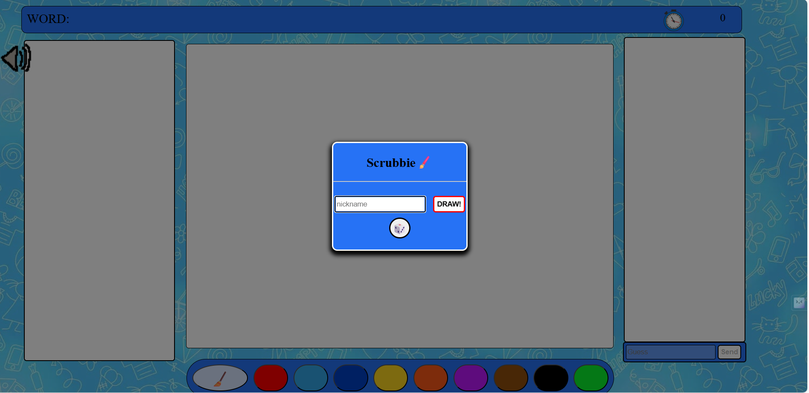
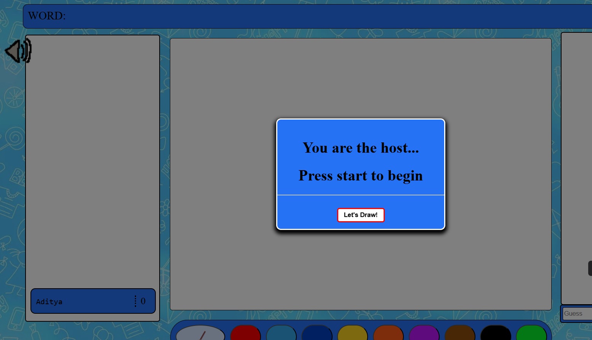
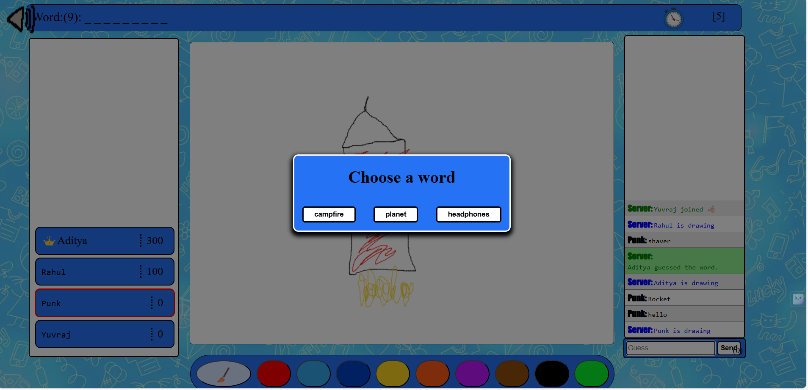
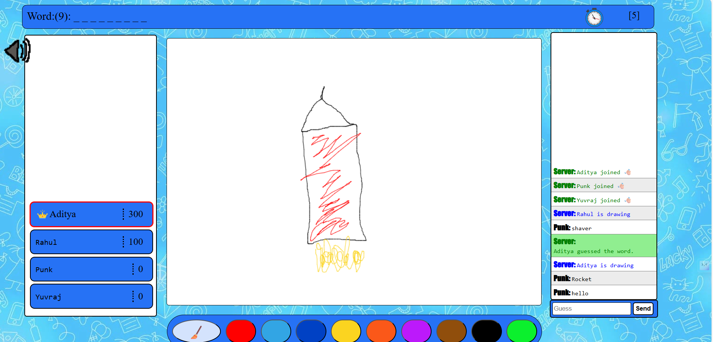

# Scrubbie🖌️

Scrubbie is a lively multiplayer online drawing and guessing game, inspired by similar games in the genre, built using **CSS**, **JavaScript** **Node.js** and **Socket.io**. Players take turns sketching a given word on canvas while others race to guess it correctly. With real-time communication via Socket.io, participants can chat, share their drawings, and engage in a fun, interactive gaming environment. Unleash your creativity and enjoy the competition in DoodleGuess! 🎨  

This project is my first attempt at recreating a popular drawing-based game.

---

## Features

- **Real-Time Interaction**: Seamless chat and drawing updates using Socket.io.
- **Multiplayer Fun**: Players take turns drawing and guessing in a lively, competitive setting.
- **Voting System**: Rate drawings with thumbs-up (👍) or thumbs-down (👎).
- **Scoring**: Earn points for correct guesses, with faster guesses yielding higher scores.
- **Customizable**: Easily modify the server code to adjust game settings or port.
- **Admin-Commands**: Admin using admin commands can maintain the fair game for all. 

---

## How to Play
1. Run the game and roll the dice to get a cool nickname.
2. The first player to join becomes the **host**, and others wait for the host to start the game.
3. Once the game begins, you’ll be assigned a word to draw.
4. Use the provided drawing tools to create a visual representation of your word.
5. Other players attempt to guess the word based on your sketch via the chatbox.
6. Simultaneously, guess what others are drawing by typing your answers in the chat.
7. Vote on each drawing’s quality with a thumbs-up (👍) or thumbs-down (👎).
8. Correct guesses earn points, with quicker guesses scoring more.
8. The game cycles through players, alternating between drawing and guessing rounds.
10. Enjoy the dynamic chat and playful interactions throughout!

---

### Commands are available for Admin to tweak the server settings from the chat.

Use //admin {admin-pass} {command} {player-name} to make changes.

Some of the available options are:

Kickall
Example: //admin {admin-password} kickall
Kicks all the connected players and restarts the game.

Kick
Example: //admin {admin-password} kick {player-name}
Kicks a specific player from the game.

GivePoints
Example: //admin {admin-password} givePoints {player-name} {value}
Adds the specified points to the player.

Setdrawtime
Example: //admin {admin-password} setdrawtime {value *in seconds}
Sets the time given to draw the word.

Setchoosetime
Example: //admin {admin-password} setchoosetime {value *in seconds}
Sets the time given to choose a word.

Restart
Example: //admin {admin-password} restart
Restarts the game for all players.

### Screenshots





## Setup and Installation

### Prerequisites

- **Node.js**: Ensure Node.js is installed on your system.
- **npm**: Node Package Manager for installing dependencies.

### Required Packages

- **[Express JS](https://www.npmjs.com/package/express)**: Web framework for Node.js.
  ```bash
  $ npm install express
  ```

- **[Socket.io](https://www.npmjs.com/package/socket.io)**: Enables real-time communication.
  ```bash
  $ npm install socket.io
  ```

### Running the Server

1. Clone the repository:
   ```bash
   $ git clone <repository-url>
   $ cd DoodleGuess
   ```

2. Install dependencies:
   ```bash
   $ npm install
   ```

3. Start the server:
   ```bash
   $ node server.js
   ```

4. Access the game at [http://localhost:3000](http://localhost:3000). The default port is `3000` but u can modify it futher in server.js.

---

## Contributing

Contributions are welcome! Feel free to submit issues or pull requests to improve Scrbble.
Potential Improvements :
1.Adding Private and Public Lobby.
2.Various tool (Circle , Rectangle) for Drawing.
3.Add More Colors and Word Pool.

---
Happy sketching and guessing! 🎉